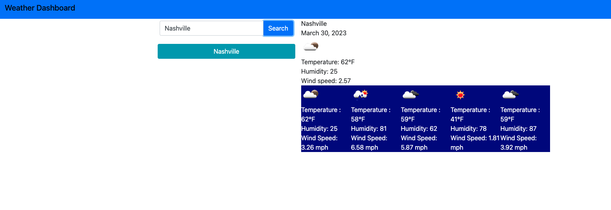

## Table of Contents
  * [License](#License)
  * [Title](#Title)
  * [Description](#Description)
  * [Technologies](#Technologies)
  * [Questions](#Questions)
  * [Feature](#Feature)
  
  ## License
  
  

  # Weather-Dashboard 
  ### Grant Ellington
  ## Description
  
  This project uses a Weather API to show current and weather and forcast and lets you search by city.

  
  
  ## Technologies
  Project is created with:
  * HTML
  * CSS
  * JavaScript
  
  
  ## Questions
  Grant-Ellington
  [gellingtonem6@gmail.com](gellingtonem6@gmail.com)

  ## Features
  

  * Search by city.
  * utilizes local storage to auto populate previous cities.
  * create a dashboard of cities based on search.
  * utilizes Bootstrap for CSS
  
